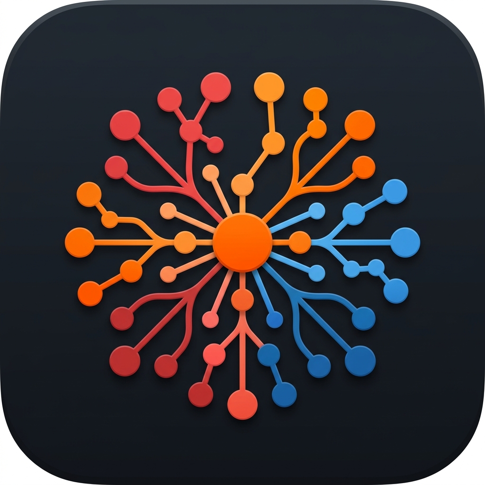

# Opensource Xmind

<p align="center">
  
</p>

<div align="center">

**A free, open-source mind mapping app inspired by Xmind**


</div>

---

## 📥 Download

To download the latest Windows installer, go to the [Releases](../../releases) page and download `Opensource Xmind Setup x.x.x.exe`.

---

## ✨ Features

- **Create mind maps** by adding topics, sub-topics, and connections
- **Rename topics** by double-clicking on them
- **4 visual themes**: Default, Dark, Ocean, Sunset
- **Pan the canvas** by holding `Space` and dragging
- **Zoom** with the mouse wheel
- **Auto-save** to local IndexedDB (no internet required)
- **Export** to JSON, SVG, and PNG (with the selected theme's colors)
- **Import** from JSON (to restore a backup)
- **Full Undo / Redo** support
- **Run as a desktop app** (Electron) or **in the browser** (localhost)

---

## 🖥️ Desktop App

Download the installer from the [Releases](../../releases) page and run it on Windows.

---

## 🛠️ Run Locally (Development)

### Prerequisites

- [Node.js 20+](https://nodejs.org/)

### Steps

```bash
# 1. Clone the repository
git clone https://github.com/MAINMMTTMAIN/opensource-xmind.git
cd opensource-xmind

# 2. Copy default environment config
copy .env.example .env

# 3. Install dependencies
npm install

# 4. Start the dev server
npm run dev
```

Then open your browser at `http://127.0.0.1:5173`.

---

## 🚀 Run Production Build in Browser

```bash
npm run start
```

This builds the project and serves it at `http://127.0.0.1:4173`.

---

## 📦 Build the Windows EXE

```bash
npm run electron:build
```

The installer will be generated in the `dist_electron/` folder.

---

## ⌨️ Keyboard Shortcuts

| Key | Action |
|-----|--------|
| `Tab` | Add child topic |
| `Enter` | Add sibling topic |
| `Delete` / `Backspace` | Delete selected topic |
| `Ctrl+Z` | Undo |
| `Ctrl+Y` / `Ctrl+Shift+Z` | Redo |
| `Ctrl+S` | Manual save |
| `Escape` | Cancel connection or editing |
| Double-click on topic | Edit topic text |
| Double-click on empty canvas | Add floating topic |
| `Space` + Drag | Pan the canvas |
| Mouse wheel | Zoom in / out |

---

## 🏗️ Project Architecture

```text
opensource-xmind/
├── src/
│   ├── components/
│   │   ├── Canvas.tsx      # Interactive mind map canvas (drag, drop, render)
│   │   ├── MapEditor.tsx   # Editor screen (toolbar, actions, shortcuts)
│   │   └── MapHome.tsx     # Home screen (list maps, import/export, themes)
│   ├── model/
│   │   ├── editor.ts       # Core logic (Undo/Redo, state reducer, themes)
│   │   ├── export.ts       # SVG/PNG generation with theme support
│   │   ├── sample.ts       # Sample map data
│   │   └── validate.ts     # JSON import validation
│   ├── db.ts               # IndexedDB wrapper (local storage)
│   ├── types.ts            # TypeScript interfaces
│   ├── index.css           # Global styles and theme variables
│   └── App.tsx             # Main routing and screen management
├── main.js                 # Electron main process (desktop wrapper)
├── vite.config.ts          # Vite build configuration
├── playwright.config.ts    # E2E test configuration
└── package.json            # Dependencies and build scripts
```

- **React + TypeScript + Vite** — Single-page app rendering
- **Electron** — Desktop app packaging
- **IndexedDB** — Local-only storage (no server needed)
- **No analytics, no accounts, no data sent anywhere**

---

## 📜 License

This project is licensed under the [MIT License](LICENSE).

Made with ❤️ by MMTT
